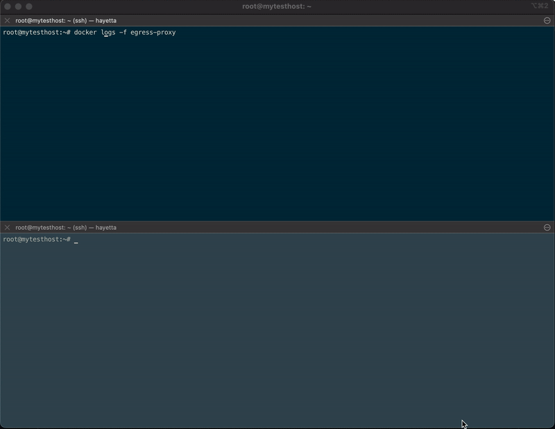

# Openresty-based proxy to restrict egress connectivity
## Demo


## Setup
* Add your servers to `hosts`
* Run Ansible
```s
$ ansible-playbook -i hosts site.yml
```

## Restrict non-proxy connections with `iptables`
```s
$ iptables --new-chain SANDBOX
$ iptables -A OUTPUT -m owner --uid-owner john.doe -j SANDBOX
$ iptables -A SANDBOX -m state ! --state NEW -j RETURN
$ iptables -A SANDBOX -p tcp -d 172.16.0.0/12 -j RETURN
$ iptables -A SANDBOX -p udp -d 172.16.0.0/12 -j RETURN
$ iptables -A SANDBOX -p udp -d 1.1.1.1/32 --dport 53 -j RETURN
$ iptables -A SANDBOX -m state --state NEW -j LOG --log-prefix "Filtered outbound connection: "
$ iptables -A SANDBOX -j REJECT
```

## See also [article on Medium](https://medium.com/@lev-petrushchak/how-to-restrict-and-track-linux-user-outbound-connections-8fb98125c3c5)
